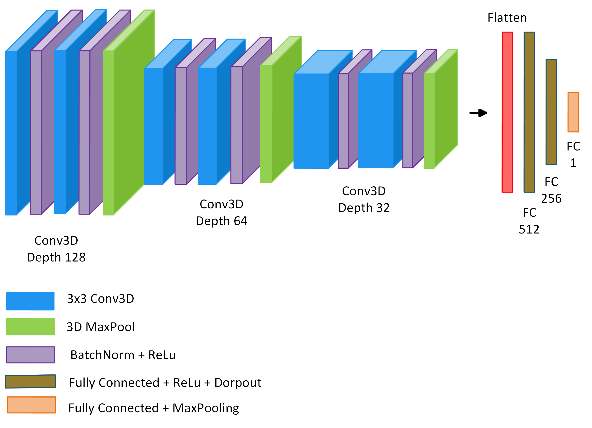

# CBVCC_CNN – 3D CNN for Video Classification
This repository implements a full pipeline for training and evaluating a video classification model using 3D Convolutional Neural Networks (3D CNNs) for the Cell Behavior Video Classification Challenge (CBVCC). More details about CBVCC are available on the [official challenge page](https://immunemap.org/index.php/challenges-menu/cbvcc).

## Model Architecture

The classification model is a **3D Convolutional Neural Network (3D CNN)**. It processes input tensors of shape `(20, 50, 50, 3)` representing a video-patch of 20 frames, each 50×50 pixels, RGB.

<p align="center">
  
</p>

This architecture is designed to extract **rich spatiotemporal features** from short video-patches and is optimized for **binary classification tasks**.

## Installation instructions
First, clone the CBVCC_CNN repository:
```bash
git clone https://github.com/rcabini/CBVCC_CNN.git
```
Create a virtual environment with Anaconda:
```bash
conda env create -f environment.yml
conda activate environment
```

## Dataset Structure

Each dataset folder (train, validation, test) should contain either class subfolders (for labeled data) or video files directly.
```
dataset/
├── train/
│   ├── 0/
│   └── 1/
├── validation/
│   ├── 0/
│   └── 1/
└── test/
    ├── video1.avi
    └── video2.avi
```

## Training
To train the model on your dataset, run:
```bash
python main_training.py \
  --training_path path/to/train/data \
  --validation_path path/to/val/data \
  --weights_path path/to/output/weights
```

## Evaluation / Inference
To evaluate a trained model on new test videos:
```bash
python run_CBVCC.py \
  --testing_path path/to/test/data \
  --weights_path path/to/output/weights
```

## License
The CBVCC repository is licensed under the Apache License 2.0 license. See the file LICENSE for more details.
